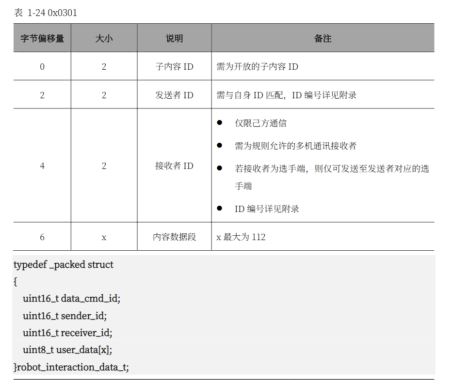
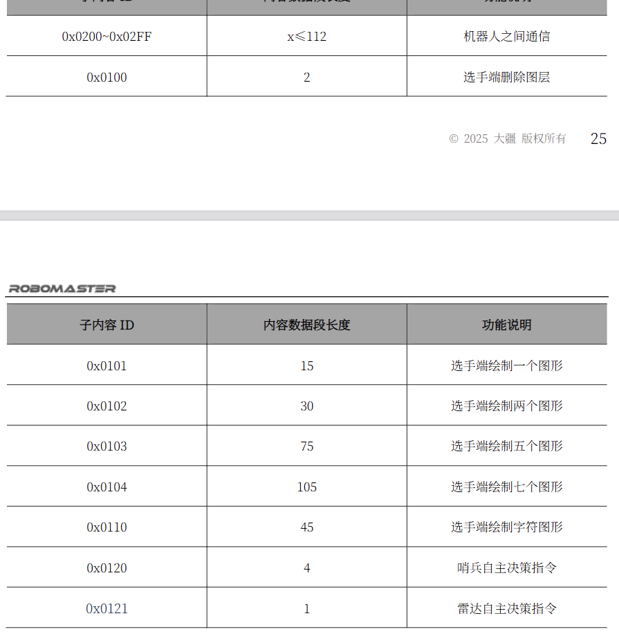
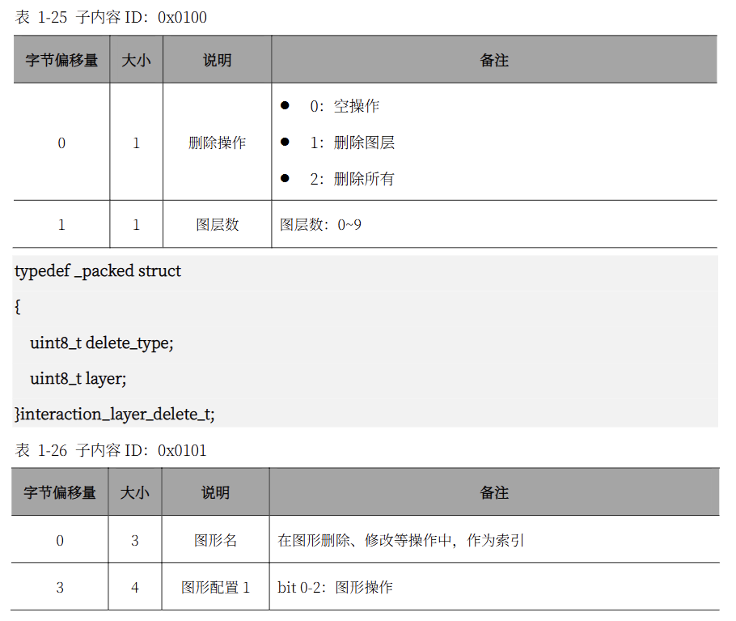
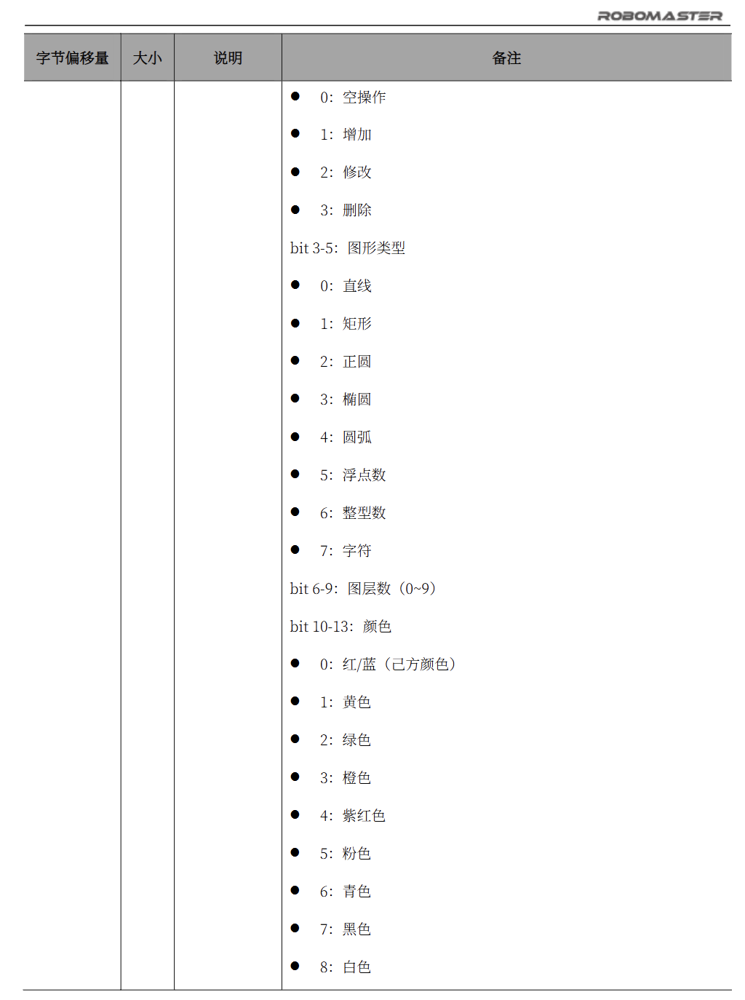

# rm_ui

`rm_ui` 负责把上层绘图服务请求转换成裁判系统 UI 交互数据，并以
`rm_message::msg::SendMessage` 发布到指定 topic。本包不直接处理 UART，只负责
ROS 2 节点内的 UI 缓存、协议打包和发送节奏控制。

## 工作方式

节点 `rm_ui` 接收绘图/删除服务请求，维护一份按 `图形名` 索引的 UI 缓存，并在
定时 `update` 中自动发送裁判系统 `cmd_id = 0x0301` 的交互数据。

当前支持的子内容 ID：

- `0x0100`: 删除图层/删除全部
- `0x0101`: 绘制 1 个普通图形
- `0x0102`: 绘制 2 个普通图形
- `0x0103`: 绘制 5 个普通图形，不足槽位补空操作
- `0x0104`: 绘制 7 个普通图形，不足槽位补空操作
- `0x0110`: 绘制 1 个字符串图形

协议格式可参考 `asset` 目录中的裁判系统说明截图：









增加和修改由节点根据 `图形名` 自动决定：缓存中不存在该名称时发送 Add，已存在时
发送 Modify。删除由 `delete_layer` 或 `delete_all_layers` 服务显式触发。`draw_shape` 和 `draw_figure`
都会拒绝把同一个 `图形名` 改成不同 `figure_type`；如果确实需要换类型，应换名称，
或先删除对应图层/全部后重新绘制。

删除请求优先于绘图请求发送。若一个图形已经从旧图层移动到新图层但尚未发布，此时
删除旧图层，节点会把这条待发送更新改为 Add，避免客户端已删除图形后再收到 Modify。

## 服务接口

### `draw_shape`

推荐上层使用的语义化绘图服务。服务类型为 `rm_ui/srv/DrawShape`，请求方只需要填
对应图形类型需要的字段，不需要关心底层 `details_a/b/c/d/e`。

```srv
uint8 TYPE_LINE=0
uint8 TYPE_RECT=1
uint8 TYPE_CIRCLE=2
uint8 TYPE_ELLIPSE=3
uint8 TYPE_ARC=4
uint8 TYPE_FLOAT=5
uint8 TYPE_INT=6
uint8 TYPE_STRING=7

uint8 COLOR_TEAM=0
uint8 COLOR_YELLOW=1
uint8 COLOR_GREEN=2
uint8 COLOR_ORANGE=3
uint8 COLOR_MAGENTA=4
uint8 COLOR_PINK=5
uint8 COLOR_CYAN=6
uint8 COLOR_BLACK=7
uint8 COLOR_WHITE=8

string name
uint8 figure_type
uint8 layer
uint8 color
uint16 width
uint16 start_x
uint16 start_y
uint16 end_x
uint16 end_y
uint16 radius
uint16 x_semiaxis
uint16 y_semiaxis
uint16 start_angle
uint16 end_angle
uint16 font_size
float64 float_value
int32 int_value
string text
---
bool success
string message
```

字段含义：

- `name`: 1 到 3 个可打印 ASCII 字符，内部补零转换为裁判协议的 3 字节图形名。
- `figure_type`: 图形类型，使用服务内的 `TYPE_*` 常量。
- `layer`: 图层，范围 `0..9`。
- `color`: 颜色，使用服务内的 `COLOR_*` 常量，范围 `0..8`。
- `width`: 线宽，10 bit 无符号值。
- `start_x`, `start_y`: 起点、圆心或文本起始点坐标，11 bit 无符号值。

各类型使用的附加字段：

| 类型 | 使用字段 |
| --- | --- |
| `TYPE_LINE` | `end_x`, `end_y` |
| `TYPE_RECT` | `end_x`, `end_y` |
| `TYPE_CIRCLE` | `radius` |
| `TYPE_ELLIPSE` | `x_semiaxis`, `y_semiaxis` |
| `TYPE_ARC` | `x_semiaxis`, `y_semiaxis`, `start_angle`, `end_angle` |
| `TYPE_FLOAT` | `font_size`, `float_value` |
| `TYPE_INT` | `font_size`, `int_value` |
| `TYPE_STRING` | `font_size`, `text` |

校验规则：

- 未被当前 `figure_type` 使用的字段必须保持默认值：数值字段为 `0`，`text` 为空。
- `end_x/end_y/x_semiaxis/y_semiaxis` 必须能放入 11 bit。
- `radius` 必须能放入 10 bit。
- `font_size` 必须能放入 9 bit。
- `start_angle/end_angle` 范围为 `0..360`。
- `text` 最多 30 字节，只允许可打印 ASCII 字符。
- `float_value` 必须为有限非负值，节点按 `value * 1000` 截断后写入协议 32 bit 字段。

### `draw_figure`

底层协议级绘图服务，服务类型为 `rm_ui/srv/DrawFigure`。该接口直接暴露裁判协议字段，
主要用于兼容或调试。一般业务代码应优先使用 `draw_shape`。

```srv
uint8[3] figure_name
uint32 figure_type
uint32 layer
uint32 color
uint32 details_a
uint32 details_b
uint32 width
uint32 start_x
uint32 start_y
uint32 details_c
uint32 details_d
uint32 details_e
uint8[] chars
---
bool success
string message
```

`draw_figure` 会检查所有字段是否满足协议位宽要求；字符串类型要求 `chars` 最多
30 字节，且 `details_b == chars.size()`。非字符串类型要求 `chars` 为空。

### `delete_layer`

删除服务，服务类型为 `rm_ui/srv/DeleteLayer`。

```srv
int8 layer
---
bool success
string message
```

- `layer = -1`: 删除全部图形。
- `layer = 0..9`: 删除指定图层。
- 其他值会被拒绝，不会发布删除包。

### `delete_all_layers`

删除全部图形的触发服务，服务类型为 `std_srvs/srv/Trigger`。调用后节点会发布
裁判协议删除全部图形包，并清空本地 UI 缓存。该服务等价于调用 `delete_layer`
并传入 `layer = -1`，适合只需要触发动作、不想构造 `DeleteLayer` 请求的上层节点。

```srv
---
bool success
string message
```

## 参数

`rm_ui` 节点参数：

| 参数 | 默认值 | 说明 |
| --- | --- | --- |
| `sender_topic` | `send_message` | 输出 `rm_message::msg::SendMessage` 的 topic |
| `sender_hz` | `30.0` | 定时发送频率，必须大于 0 |
| `sender_target` | `2` | `SendMessage.target`，仅允许 `1` 或 `2` |
| `sender_id` | `0` | 裁判交互发送者 ID，必须配置为 `1..65535` |
| `receiver_id` | `0` | 裁判交互接收者 ID，必须配置为 `1..65535` |

`sender_id` 和 `receiver_id` 没有有效默认值，启动时必须通过参数配置。

## 调试节点

包内还提供 `rm_ui_debugger` 节点，用于订阅 `SendMessage` 并渲染调试图像，输出
`sensor_msgs::msg::Image`。该节点只用于本地可视化和测试，不参与实际发送链路。

`rm_ui_debugger` 参数：

| 参数 | 默认值 | 说明 |
| --- | --- | --- |
| `input_topic` | `send_message` | 输入 `SendMessage` topic |
| `image_topic` | `ui_debug/image` | 输出调试图像 topic |
| `frame_id` | `rm_ui_debug` | 图像 header frame id |
| `image_width` | `1920` | 调试图像宽度 |
| `image_height` | `1080` | 调试图像高度 |
| `protocol_width` | `1920` | 裁判协议坐标系宽度 |
| `protocol_height` | `1080` | 裁判协议坐标系高度 |
| `draw_names` | `true` | 是否在图形旁绘制名称 |
| `font_scale_factor` | `0.04` | 字体缩放系数 |
| `publish_hz` | `30.0` | 调试图像发布频率 |

## 构建与测试

```bash
colcon build --packages-select rm_ui
colcon test --packages-select rm_ui --event-handlers console_direct+
```
